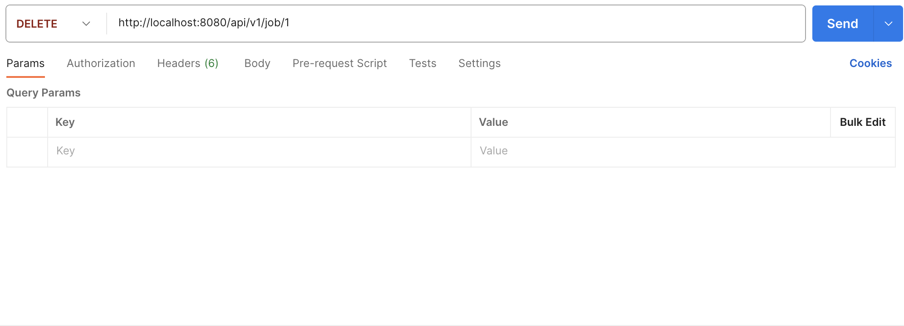
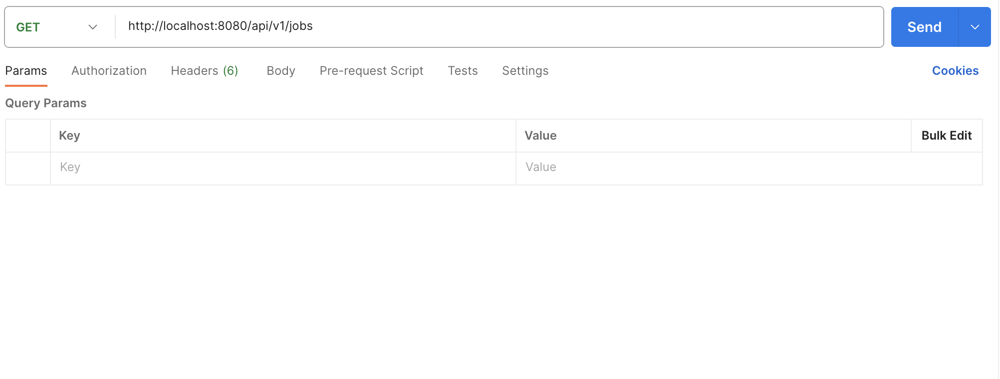
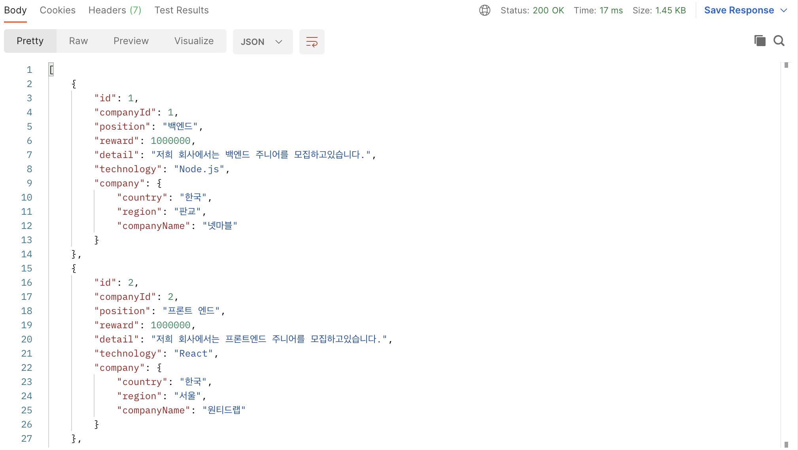
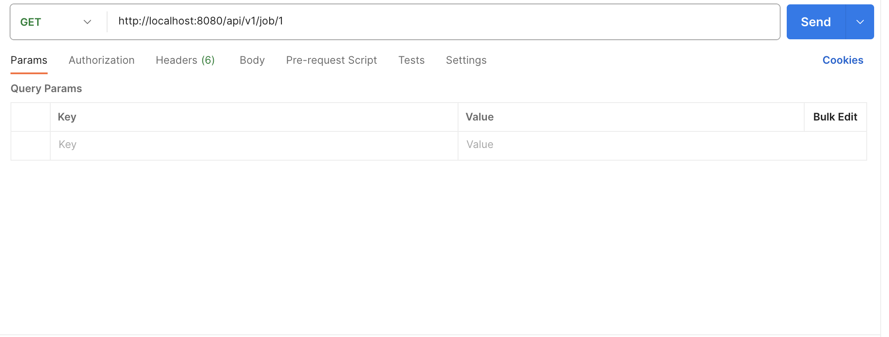

# 원티드 프리온보딩 백엔드 인터쉽 선발과제

---

## 지원자 : 손태권

---

# 목차

### [1. 기술 스택](#기술-스택)

### [2. 어플리케이션 실행방법 및 환경변수](#어플리케이션-실행방법-및-환경변수)

### [3. API Docs](#API-Docs)

### [4. 개발 프로세스](#개발-프로세스)

---

# 기술 스택


---

# 어플리케이션 실행방법 및 환경변수

1.모듈을 설치합니다.

```
npm install
```

2.환경변수파일을 생성하고 등록합니다. (.env)

```
DB_PASSWORD={데이터베이스 비밀번호입니다.}
DB_USERNAME={데이터베이스 사용자이름입니다.}
DB_HOST={데이터베이스 호스트 주소입니다.} default: localhost
DB_NAME={데이터베이스 이름입니다.}      default: wanted-pre-onboarding
SERVER_PORT={서버실행 포트입니다.}     default: 8080
```

3.Mysql DB를 생성합니다

```
npx sequelize db:create
```

4.어플리케이션을 실행합니다.

```
npm start
```

5.Mysql Seed를 추가합니다

```
npx sequelize db:seed:all
```

---

# API Docs

---

### 1. 채용공고를 등록합니다

### request


### response


### 2. 채용공고를 수정합니다.

### request


### response


### 3. 채용공고를 삭제합니다.

### request



### response


### 4. 모든 채용공고를 가져옵니다.

### request



### response



### 5. 채용공고 상세보기

### request



### response

## 

### 6.채용공고 지원하기

### request


### response

## 

---

# 개발 프로세스

1. [x] 채용공고 등록 기능
2. [x] 채용공고 수정 기능
3. [x] 채용공고 삭제 기능
4. [x] 채용공고 목록 가져오기 기능
5. [ ] 채용공고 검색 기능 구현 (Optional)
6. [x] 채용 상세 페이지 가져오기
7. [ ] 채용공고에 지원 기능 (Optional)
